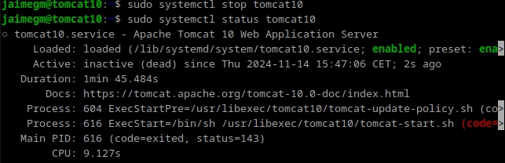
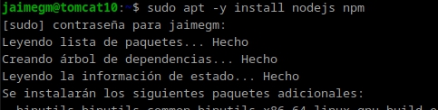
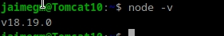
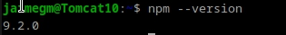
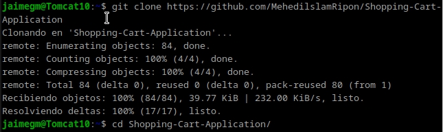
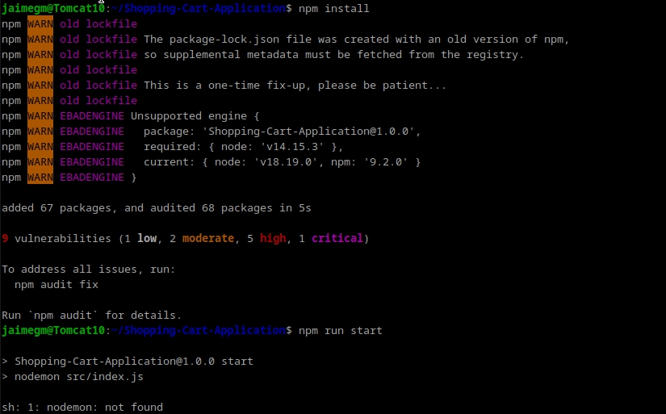
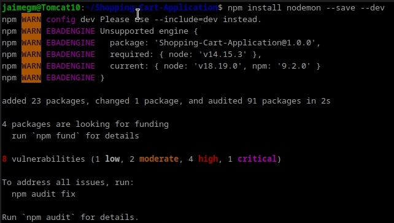
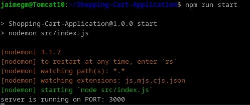
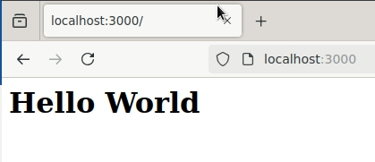

# Practica 3.2: Despliegue de Aplicaciones con Node Express

### Jaime Grueso Martin

## Indice
1. [Introducción](#id1)
2. [Instalación de Node.js, Express y Test de la Primera Aplicación](#id2)
3. [Despliegue de una Nueva Aplicación](#id3)
4. [Cuestiones](#id4)

## Introducción
En esta práctica se procederá a el despliegue de aplicaciones con Node Express. 

Primeramente, se parará el servicio de Tomcat para evitar problemas a la hora de desplegar la aplicación.

## Instalación de Node.js, Express y Test de la Primera Aplicación
Para instalar Node.js y NPM, se ejecutará el siguiente comando:

Para comprobar que se han instalado correctamente, se ejecutarán el siguiente comando:

A continuación, se procederá a clonar un repositorio de GitHub con una aplicación de ejemplo. Para ello, se ejecutará el siguiente comando y después se accederá a la carpeta de la aplicación:

## Despliegue de una Nueva Aplicación

Dentro de la carpeta de la aplicación, se ejecutará el siguiente comando para instalar las dependencias de la aplicación:

Como se aprecia hay un error en la instalación de las dependencias, `sh: 1: nodemon: not found`. Para solucionar este error, se ejecutará el siguiente comando:

Una vez solucionado el error, se procederá a ejecutar la aplicación con el siguiente comando:

Si se accede a la dirección `http://localhost:3000/`, se podrá ver la siguiente pantalla:

## Cuestiones
**Cuando ejecutáis el comando npm run start, lo que estáis haciendo es ejecutar un script:**

**¿Donde podemos ver que script se está ejecutando?**

**¿Qué comando está ejecutando?**

Cuando se ejecuta `npm run start`, el comando que se ejecuta está definido en el archivo `package.json`, en la sección `scripts`. Simplemente se abre `package.json` y se comprueba qué comando está asociado a `start`.

