# Práctica 3.4: Despliegue de una Aplicación React en Netlify (PaaS)

## Jaime Grueso Martin

### Indice
1. [Creación de Nuestra Aplicación](#id1)
2. [Aplicación para Netlify](#id2)
3. [Proceso de Despliegue en Netlify](#id3)
    1. [Despliegue Mediante CLI](#id31)
    2. [Despliegue Mediante Conexión con Github](#id32)

## Creación de Nuestra Aplicación
Primeramente, se deberá loggear en la máquina anfitriona con SSH. Para ello, se ejecutará el siguiente comando:

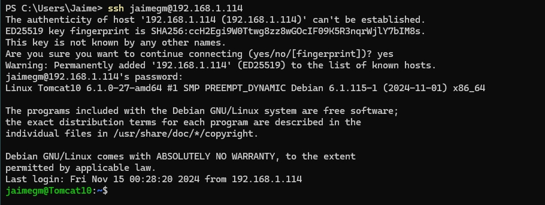

Tras esto, se procederá a crear una carpeta en el escritorio que tendrá tres archivos: `head.html`, `tail.html` y `aplicacion.js`. Para ello, se ejecutarán los siguientes comandos:

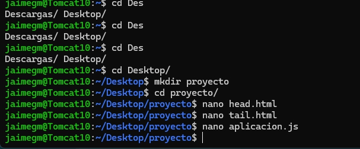

Dentro de la carpeta, se han creado los archivos mencionados anteriormente y habrá que añadir el siguiente código a cada uno de ellos:

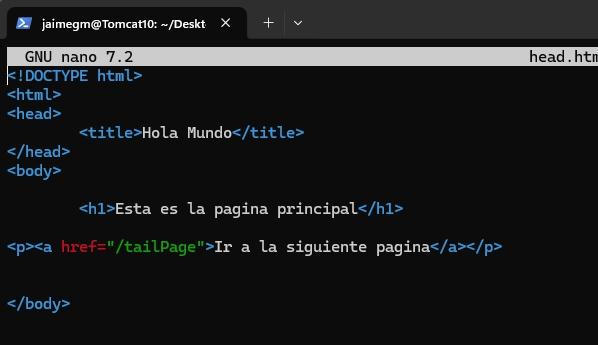

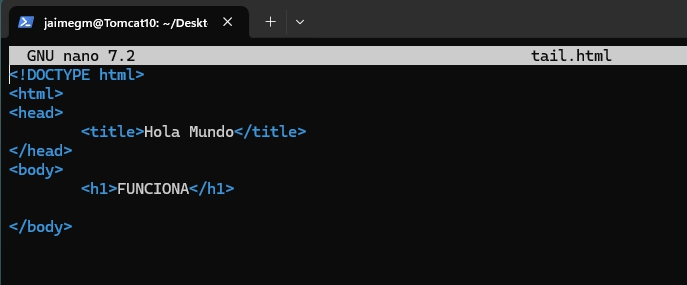

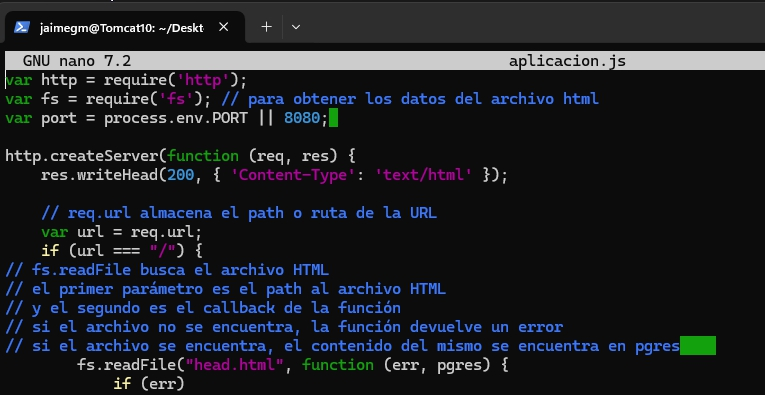

Hecho esto, se podrá ejecutar el comando `npm init` para inicializar el proyeto y nos pedirá una serie de datos que deberemos rellenar. Y se ejecutará el comando `node aplicacion.js` para ejecutar la aplicación. 

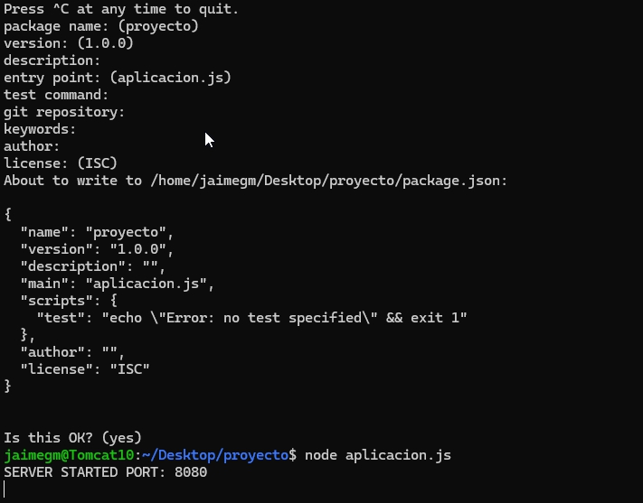

Si se sabre una pestaña del navegador y se accede a la dirección `http://localhost:8080/`, se podrá ver la siguiente pantalla:

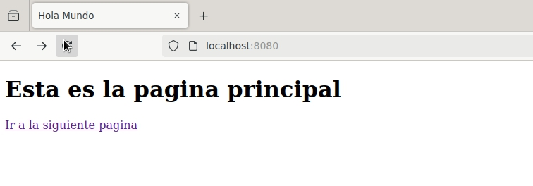

## Aplicación para Netlify

Para poder desplegar nuestra aplicación en Netlify, se deberá clonar el repositorio que se nos ha facilitado.

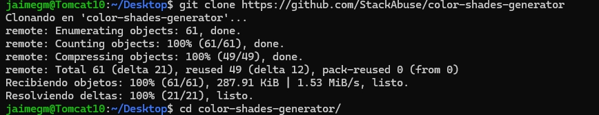

## Proceso de Despliegue en Netlify

Se desplegaraá la aplicación en Netlify mediante dos métodos: mediante CLI y mediante conexión con Github.

Para ello la primera tarea será el loggearse en la web de Netlify. Y se generará un token de acceso que se utilizará cuando se nos pida loggearnos desde la terminal.

### Despliegue Mediante CLI

Una vez se haya hecho el registro, se deberá instalar el cliente de Netlify dentro de la carpeta de la aplicación y se loggeará en la cuenta de Netlify:

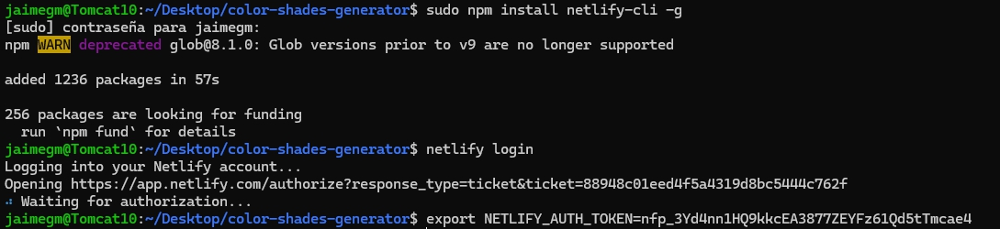

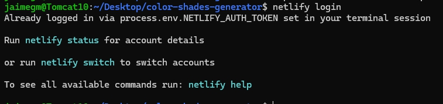

Ahora se podrá instalar npm en la aplicación y se podrá desplegar la aplicación en Netlify con los siguientes comandos:

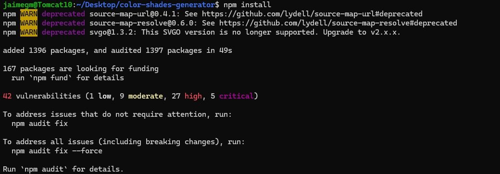

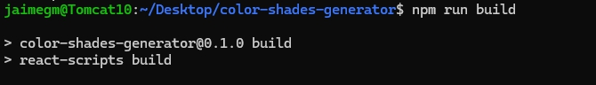

Aqui se nos harán algunas preguntas que se deben responder de la siguiente manera:
Se creará y configurará un nuevo sitio
El Team se dejará por defecto
Y se le pone el nombre que se quiera al sitio y el directorio de despliegue será `./build`.

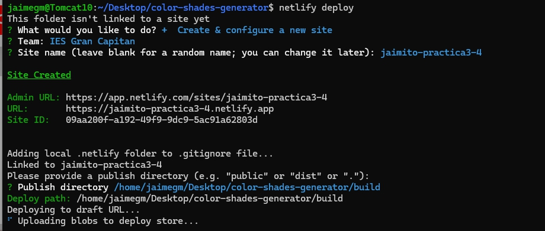

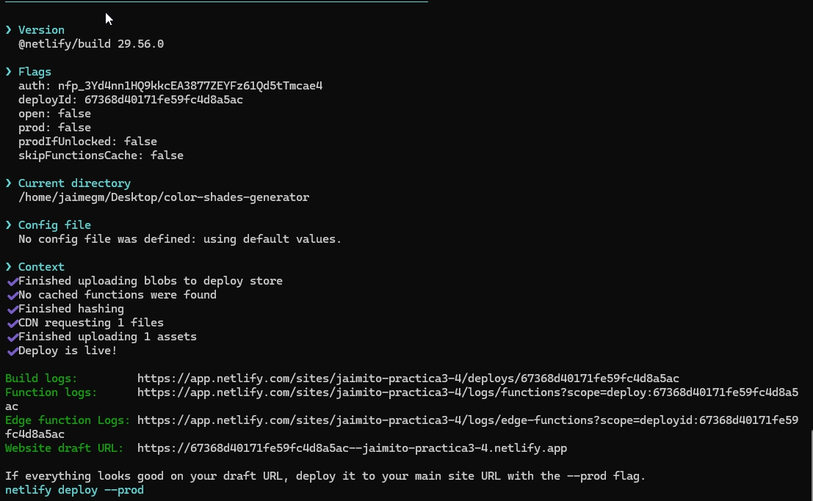

Si se accede a la dirección que se nos facilita, se podrá ver la aplicación desplegada en Netlify:

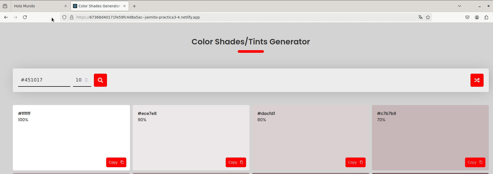

### Despliegue Mediante Conexión con Github

Para desplegar la aplicación mediante conexión con Github, lo primero que se deberá hacer es eliminar la web que hemos creado para evitar posibles conflictos.

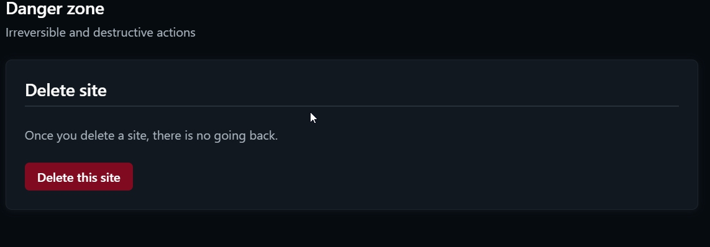

Después, se deberá borrar el directorio que se clonó anteriormente con el comando `rm -rf color-shades-generator`. 

Hecho esto, nos descargaremos el repositorio pero con el comando siguiente:

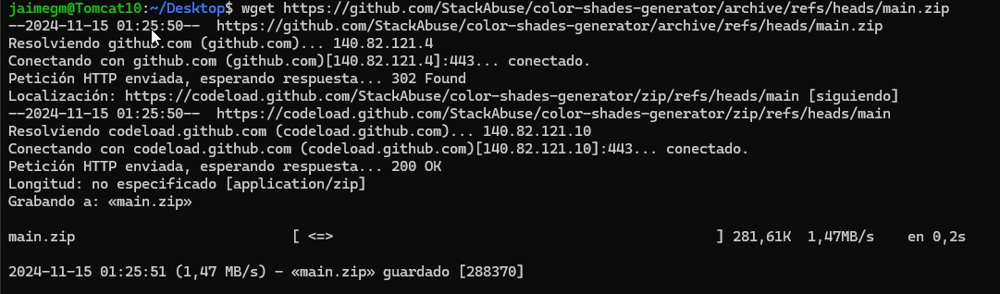

Se creará una carpeta nueva con el nombre de la prática y se extraerá el contenido del repositorio en ella.

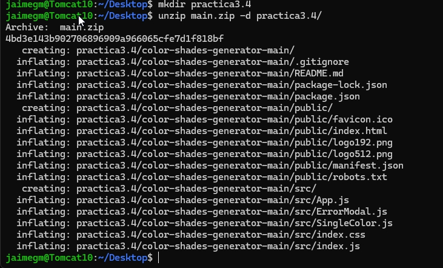

Y nos colocaremos en la carpeta de la práctica. Ahora se creará un repositorio en Github y se subirán los archivos de la práctica a él.

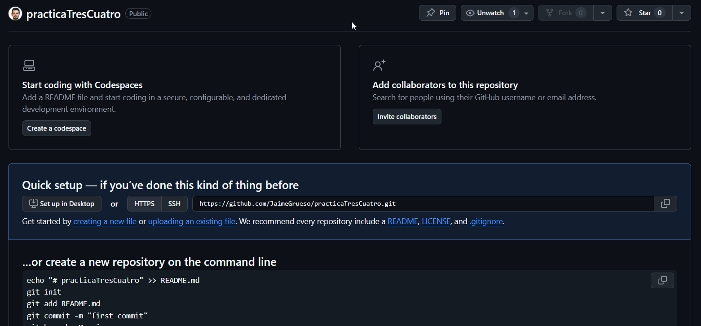

Desde la web de Netlify, se seleccionará la opción de conectar con Github y se seleccionará el repositorio que se ha creado anteriormente.

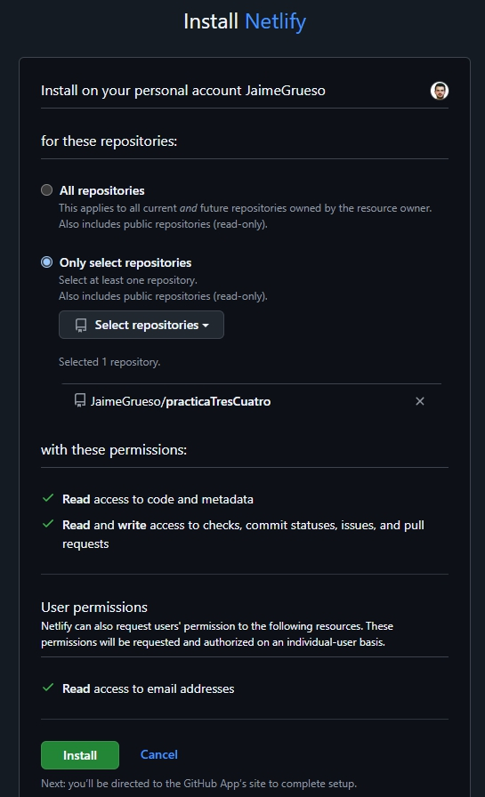

Se seleccionará el repositorio:

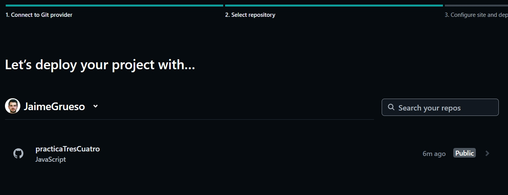

Se seleccionará la rama principal y se comprobará que le nombre de la web no esté en uso:

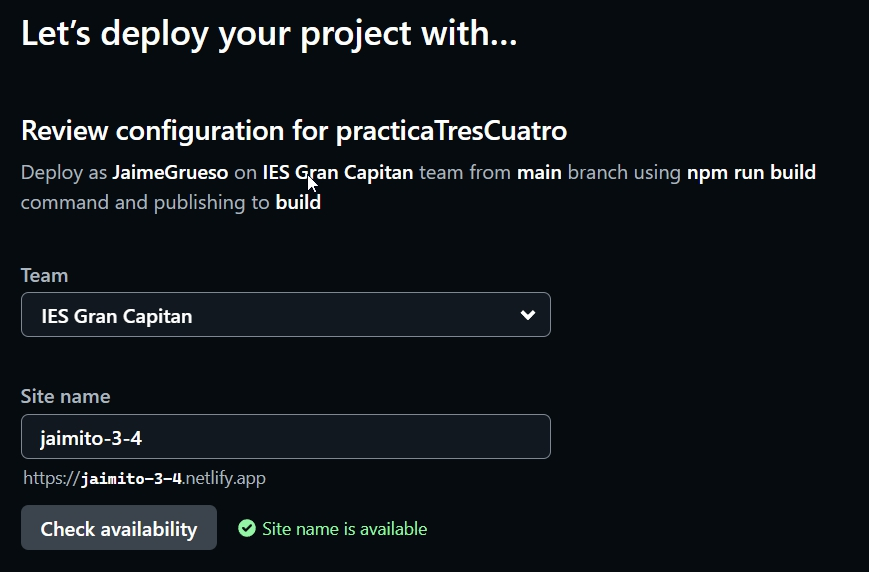

Y finalmente se desplegará la aplicación:

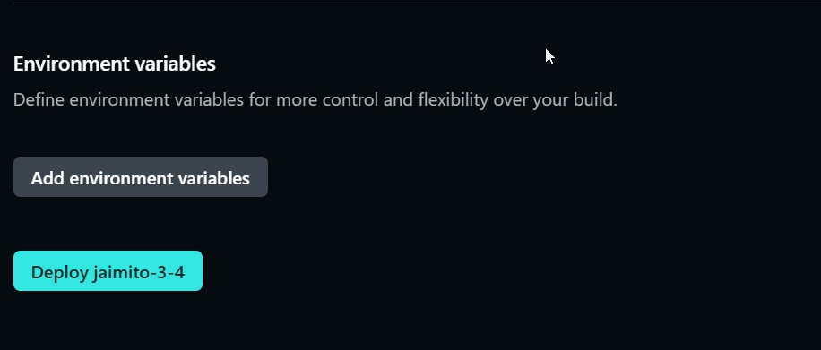

Si se accede a la dirección que se nos facilita, se podrá ver la aplicación desplegada en Netlify:

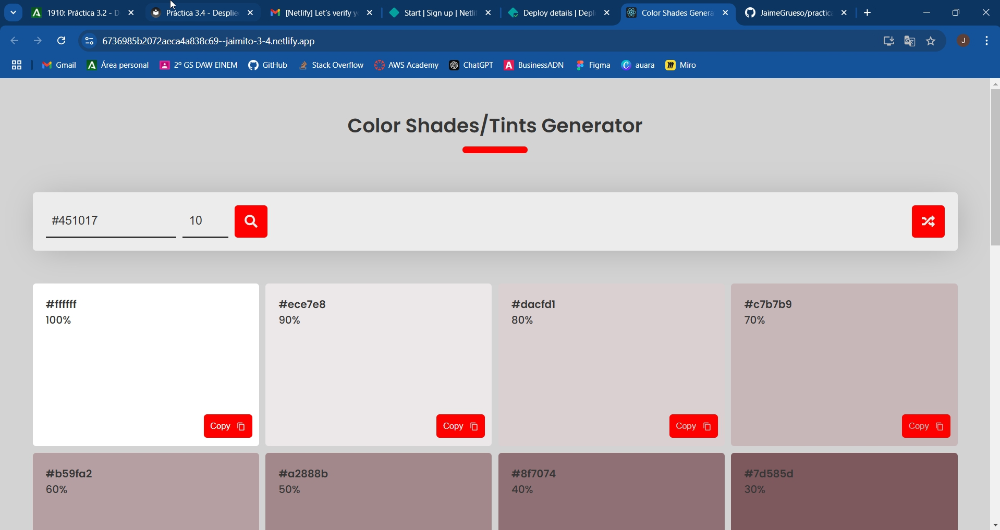

Ahora se deberá modificar el archivo `robots.txt` para indicar a que URLs del sitio se pueden acceder.

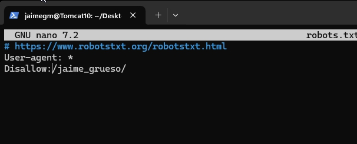

Se hará un commit y un push de los cambios y en la pantalla de Netlify se podrá ver que se ha desplegado la nueva versión de la aplicación a la hora que se hizo el commit.

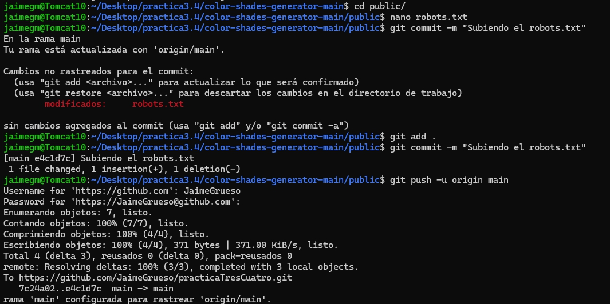

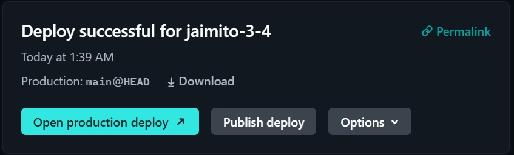

Si se accede a https://jaimito-3-4.netlify.app/robots.txt, se podrá ver el archivo `robots.txt` modificado:

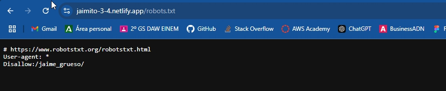

Con esto se habrá completado la práctica.

