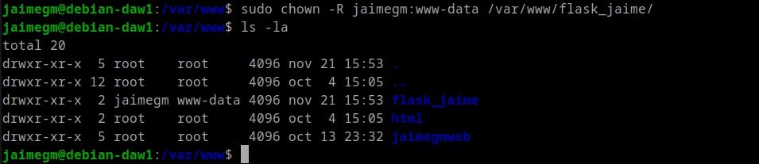

# Práctica 3.5: Despliegue de una aplicación Flask (Python)

## Jaime Grueso Martin

### Indice
1. [Prerrequisitos](#id1)
2. [Procedimiento Completo Para el Despliegue](#id2)

## Prerrequisitos
Para esta práctica se deben tener las siguientes herramientas instaladas en el sistema:
    - Nginx
    - Gunicorn
    - Pipenv

## Procedimiento Completo Para el Despliegue

Como primer paso, se ha de instalr el gestor de paquetes de Python pip:

Una vez instalado pip, se ha de instalar pipenv:

Se crea un directorio para la aplicación. Al crearla se apreciará que los permisos pertenecen a **root**. Para cambiarlos se ha de ejecutar el comando `sudo chown -R $USER:$USER /home/jaime/app`:
`drwxr-xr-x  2 root root 4096 nov 21 15:53 flask_jaime`

Para ser cambiados se ejecutará el siguiente comando:

Y se le cambiarán los permisos para que al iniciar Nginx no haya problemas:

Ahora, dentro del directorio creado con anterioridad se creará el archivo oculto `.env`

En el archivo `.env` se añadirán las siguientes lineas:

Se iniciará el entorno virtual y `Pipenv` cargará las dependencias del archivo `.env`:

Como se aprecia en la utima línea de la captura, aparece el nombre de nuestro entorno virtual, lo
cual significa que se ha iniciado correctamente.

Hecho esto, se instalarán las dependencias para la aplicación:

Se crearán los archivos `app.py` y `wsgi.py` que contendrán los siguientes codigos:

Se probará la aplicación con el comando siguiente:

Si todo ha ido bien, si se accede al enlace proporcionado se podrá ver la aplicación funcionando:

Se comprobará ahora que Gunicorn funciona correctamente:

Se tomará nota del path desde donde se ejectuta Gunicorn, para ello se ejecutará el siiguinte comandodentro de nuestro entorno virtual:

Se saldrá del entorno virtual con `deactivate`.

Se iniciará Nginx si no estaba iniciado de antemano y se comprobará que sigue funcionando perfectamente:

Se creará un archivo de configuración para que systemd ejecute Gunicorn como otro servicio mas:

Ahora se habilitará el servicio y se comprobará que se ha iniciado correctamente:

Ahora se modifiará el archivo de configuración de Nginx de la siguiente manera:

Se creará el enlace simbólico para que Nginx pueda acceder a los archivos de la aplicación:

Se comptobará que la configuración de Nginx es correcta:

Se editará el archivo `hosts` para que se pueda acceder a la aplicación desde el navegador:

Se comprobará que la aplicación funciona correctamente en el navegador:

Ahora se deberá repetir el proceso para un repositorio que se clonará de GitHub:

Se creará el archivo `.env` con las variables de entorno necesarias:

Se cambiarán los permisos del directorio y los propietarios:

Se iniciliazará el entorno virtual:

Y se probará la aplicación:

Se comprobará que funciona correctamente:

Se comprobará que Gunicorn funciona correctamente:

Y se obtendrá el path de Gunicorn:

Se saldrá del entorno virtual y se creará el archivo de configuración para systemd:

Se configurará Nginx para que pueda acceder a la aplicación:

Se habilitará el servicio y se hará el enlace simbólico:

Una vez comprobada la configuración de Nginx, se editará el archivo `hosts` para poder acceder a la aplicación desde el navegador:

Se comprobará que la aplicación funciona correctamente:

Con esto se da por finalizada la práctica.

